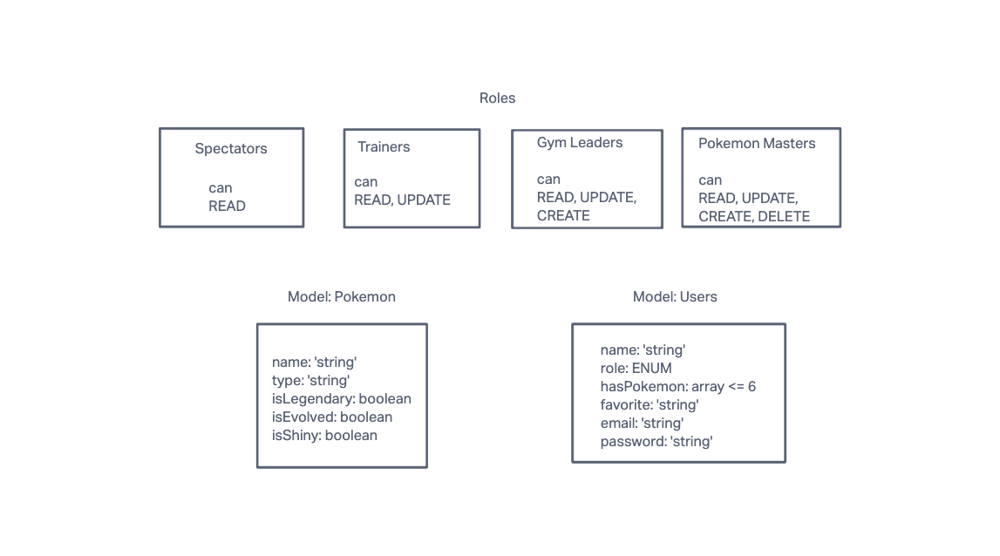

# gotta-catch-em-all

## RENDER LINK

Deployed server live here, hosted on Render. Deployed server connected to PostgreSQL 14 instance also hosted on Render.

https://gotta-catch-em-all.onrender.com

## Problem Domain

Create an Express server connected to SQL database that allows users to sign up, confirm identity with basic authentication (username/password) or bearer authentication (JSON web token), and then perform CRUD functions on the database. Users have role based access control (permissions) that restrict CRUD access to certain functions only depending on role.

## Whiteboard

## Method

Express app written based on previous labs.

3 types of users were implemented: trainer (read/create), gymLeader (read/create/update), and pokemonMaster (read/create/update/delete)

Pokemon have their own properties, and certain types of pokemon should only be used by certain roles.

Users choose a role when they sign up.

After sign up, user receives token. After creation, user can sign in with basic auth, or use token (if unexpired).

Once logged in, user can perform CRUD operations, including view any/all pokemon and edit their pokemon array.

## Testing

- Tests written for jest/supertest that validate CRUD routes and logger middleware.
- Tests were not written for authentication middleware because of limited time.
- Authentication middleware was tested with console logs, Thunderclient extension for VSCode, and "curl" shell commands.

## Limitations

SQL database tables are not relational. Users have a property of "pokemonArray" that was intended to store a stringified JSON object containing their pokemon, but it did not reach production. Pokemon can be manually added to the array with CRUD functions.
